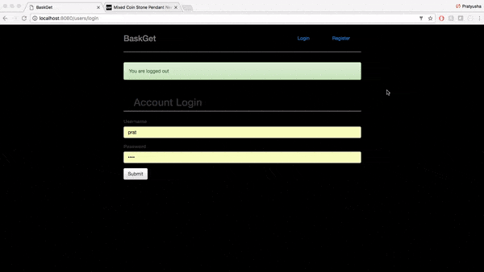

# Project3

BaskGet is a web application that allows users to bookmark online products by creating wishlists. The user enters in information about the product and will be able to go back and refer to the list and product urls. 

